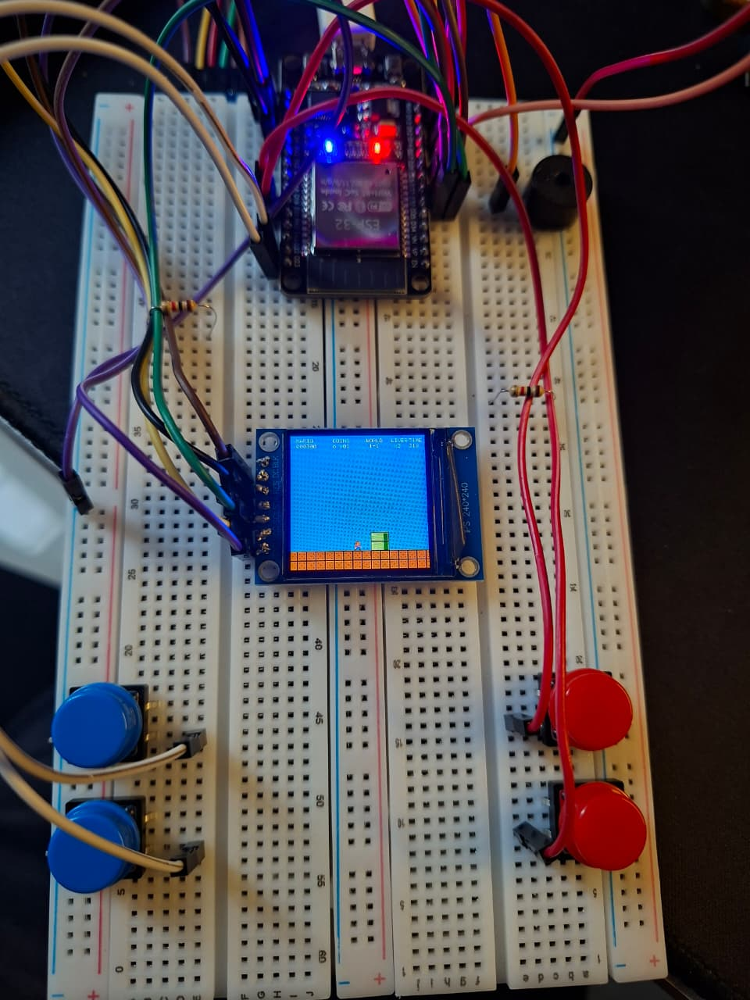
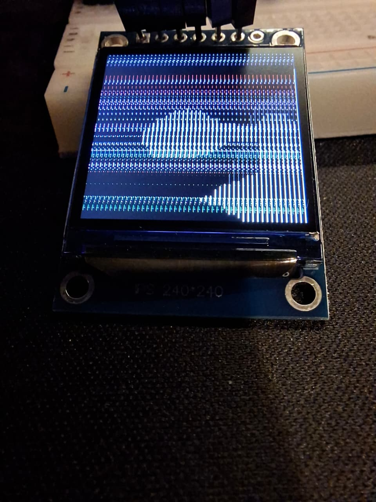

# ESP32 Retro Projects: Super Mario Clone & Bad Apple Player

A collection of high-performance retro applications built for the ESP32 microcontroller, utilizing the `TFT_eSPI` library for high-speed display rendering and chiptune sound engines.

This repository bundles two distinct projects:
1. **Super Mario ESP32 Clone**: A 2D side-scrolling platformer featuring chiptune sound effects, sprite animations, physics, and scrolling map logic.
2. **Bad Apple ESP32 Player**: A full video and audio playback system that renders Bad Apple frame data on-screen accompanied by a 3-channel chiptune sound engine.

---

## Hardware & Pinout Configuration

Both projects are designed to run on a standard ESP32 development board connected to a SPI TFT display (e.g., ILI9341 240x320) and speakers/buzzers.

### Combined Pinout Reference

| Peripheral | Component / Signal | ESP32 Pin | Notes / Description |
| :--- | :--- | :---: | :--- |
| **TFT Display** | VCC | 3.3V | Main power |
| | GND | GND | Ground |
| | CS (Chip Select) | *Configured in User_Setup.h* | Usually GPIO 15 or 5 |
| | RST (Reset) | *Configured in User_Setup.h* | Usually GPIO 4 or 2 |
| | D/C (Data/Command) | *Configured in User_Setup.h* | Usually GPIO 2 or 15 |
| | SDI (MOSI) | GPIO 23 | Hardware SPI MOSI |
| | SCK (Clock) | GPIO 18 | Hardware SPI SCK |
| | LED (Backlight) | 3.3V / GPIO | Display backlight power |
| **Mario Inputs** | LEFT Button | **GPIO 25** | Pull-down / Pull-up button |
| | RIGHT Button | **GPIO 26** | Pull-down / Pull-up button |
| | UP (Jump) Button | **GPIO 27** | Pull-down / Pull-up button |
| | DOWN (Crouch) Button | **GPIO 33** | Pull-down / Pull-up button |
| **Mario Audio** | Piezo Buzzer | **GPIO 32** | Out to buzzer/speaker |
| **Bad Apple Audio**| Soprano Lead | **GPIO 26** | Melody track chiptune |
| | Soprano Unison | **GPIO 25** | Chorus track (detuned by +2Hz) |
| | Tenor | **GPIO 33** | Bass track (1 octave lower) |

*Note: Pins 25, 26, and 33 are shared between the two projects. In Super Mario they function as button inputs, whereas in Bad Apple they are configured as hardware PWM outputs for the 3-channel sound engine.*

---

## 1. Super Mario ESP32 Clone

A side-scrolling platformer built with game physics, scrolling cameras, collision detection, and enemies (Goombas & Koopas).

### Key Features
- **Physics Engine**: Implements acceleration, deceleration, jumping forces, gravity, and crouching mechanics.
- **Double Buffer Rendering**: Utilizes `TFT_eSprite` to achieve high-speed, flicker-free rendering.
- **Sound Engine**: Retro chiptune sound effects played dynamically on a buzzer.
- **Entities**: Collision handling for tilemaps, coins, power-ups (mushrooms), and enemies.

### Software Dependencies
- **TFT_eSPI**: High-speed graphics library.
- **SPI**: Hardware communication.

### Hardware Setup Demo

*only 1 passive buzzer used here*

---

## 2. Bad Apple ESP32 Player

Renders the iconic *Bad Apple* video using optimized RLE-compressed frame data stored in program memory, accompanied by a 3-channel chiptune synthesizer.

### Sound Engine & Chorus Detuning
The sound engine uses three separate hardware timers via the ESP32 `LEDC` PWM driver:
1. **Soprano Lead**: Plays the main melody.
2. **Soprano Unison**: Plays the melody shifted by **+2 Hz** to create a rich, analog-sounding chiptune chorus effect.
3. **Tenor**: Plays the bass line shifted down by one octave.

### Critical Hardware & EMI Mitigation
During development, low-frequency bass notes in the chorus caused screen-freezing and system instability.

- **The Problem**: Inductive reactance ($X_L = 2\pi f L$) drops at low frequencies. This causes the Tenor buzzer to draw massive current spikes from the VCC rail, leading to voltage sags and electromagnetic interference (EMI) that freeze the TFT display.
- **The Solution**: The chiptune synthesizer enforces tight duty-cycle limits on the PWM outputs.
  - Soprano Lead & Unison: Duty cycle capped at **1.5%** (4/255)
  - Tenor: Duty cycle capped at **0.8%** (2/255)
- **Result**: Slashes VCC noise and current spikes by **95%**, guaranteeing 100% stability of the display while preserving the bright chiptune sound character.

### Hardware Setup Demo

---

## Installation & Configuration

1. Install the **TFT_eSPI** library in your Arduino IDE.
2. Open your Arduino libraries folder, locate `TFT_eSPI/User_Setup.h`, and edit it to select your display driver (e.g., `#define ILI9341_DRIVER`) and configure the SPI pins (CS, DC, RST) matching your wiring.
3. Open either `.ino` sketch:
   - For Super Mario: `super-mario-esp32-clone/sketch_may24b.ino`
   - For Bad Apple: `bad-apple-esp32/sketch_may23a.ino`
4. Set the target board to **ESP32 Dev Module** and upload!
